# Smart Parking System 🚗 🅿️

<div align="center">
  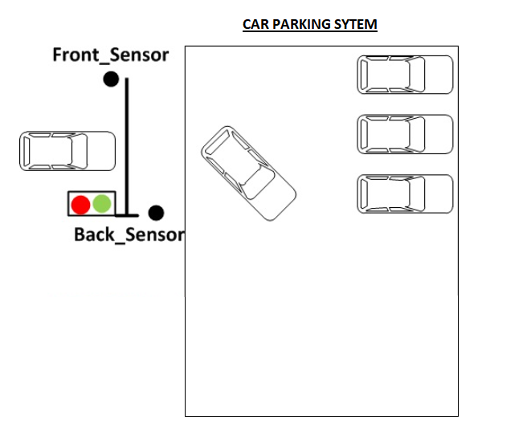
</div>

## Project Overview
The Smart Parking System is a digital design project implemented in Verilog that simulates an automated parking management system. It provides real-time monitoring of available parking spaces, automated entry/exit barriers, and fee calculation based on parking duration.

<div align="center">
  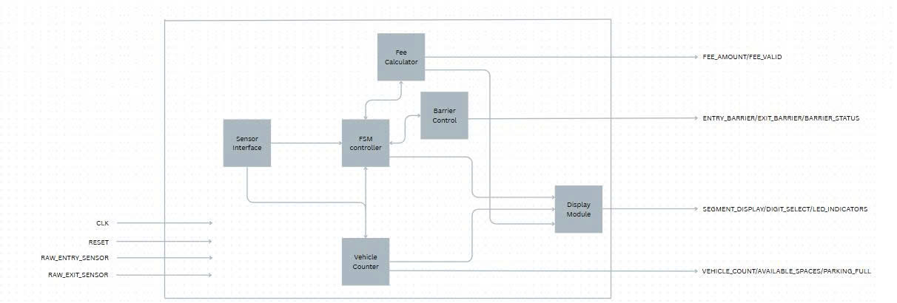
</div>

## How to Run the Project

### Prerequisites
1. Verilog HDL simulator (ModelSim, Icarus Verilog, or Xilinx Vivado)
2. FPGA development board (for hardware implementation)

### Simulation Setup
1. **Clone the repository**
   ```bash
   git clone https://github.com/KNguyen260404/Smart_parking_verilog.git
   cd Smart_parking_verilog
   ```

2. **Run simulation for individual modules**
   
   For ModelSim:
   ```bash
   # For Vehicle Counter module
   cd Vehicle_counter
   vlog Vehicle_counter.v Vehicle_counter_tb.v
   vsim -novopt work.Vehicle_counter_tb
   
   # For Sensor Interface module
   cd ../Sensor_interface
   vlog Sensor_interface.v Sensor_interface_tb.v
   vsim -novopt work.Sensor_interface_tb
   
   # For Barrier Control module
   cd ../Barrier_control
   vlog Barrier_control.v Barrier_control_tb.v
   vsim -novopt work.Barrier_control_tb
   
   # For Display module
   cd ../Display_module
   vlog Display_module.v Display_module_tb.v
   vsim -novopt work.Display_module_tb
   
   # For Fee Calculator module
   cd ../Fee_calculator
   vlog Fee_calculator.v Fee_calculator_tb.v
   vsim -novopt work.Fee_calculator_tb
   
   # For FSM Control module
   cd ../FSM_control
   vlog Fsm_control.v Fsm_control_tb.v
   vsim -novopt work.Fsm_control_tb
   ```
   
   For Icarus Verilog:
   ```bash
   # For Vehicle Counter module
   cd Vehicle_counter
   iverilog -o vehicle_counter_sim Vehicle_counter.v Vehicle_counter_tb.v
   vvp vehicle_counter_sim
   gtkwave vehicle_counter_waveform.vcd
   
   # Similar commands for other modules
   ```

3. **Run complete system simulation**
   ```bash
   cd Smart_parking_system
   vlog Smart_parking_system.v Smart_parking_system_tb.v
   vsim -novopt work.Smart_parking_system_tb
   ```

4. **View waveforms**
   - In ModelSim: After simulation, add signals to the wave window and run the simulation
   - In GTKWave: `gtkwave <module_name>_waveform.vcd`

### FPGA Implementation

1. **Create a new project in your FPGA development tool** (Xilinx Vivado or Intel Quartus)

2. **Add all Verilog files to the project**
   - Add all module files from their respective directories
   - Set Smart_parking_system.v as the top-level module

3. **Assign pin constraints**
   - Map the input/output ports to physical pins on your FPGA board
   - Create a constraints file (.xdc for Xilinx or .qsf for Intel)

4. **Synthesize and implement the design**
   - Run synthesis
   - Run implementation
   - Generate bitstream

5. **Program the FPGA**
   - Connect your FPGA board to your computer
   - Program the device with the generated bitstream

### Testing the System

1. **Entry/Exit Testing**
   - Simulate vehicle entry by triggering the entry sensor
   - Provide a valid card ID for authentication
   - Observe barrier opening, vehicle counting, and display updates

2. **Fee Calculation Testing**
   - Simulate vehicle exit after some time
   - Verify fee calculation based on parking duration
   - Check display for fee amount

3. **Edge Cases Testing**
   - Test full parking scenario
   - Test emergency mode
   - Test invalid card handling

### Troubleshooting

1. **Timing Issues**
   - If timing constraints are not met, adjust clock frequency or optimize critical paths
   - Check for setup and hold time violations

2. **Simulation vs Hardware Differences**
   - Parameters like DEBOUNCE_DELAY may need adjustment for real hardware
   - Replace simulation-only constructs with synthesizable code

3. **Common Issues**
   - Sensor debouncing problems: Increase DEBOUNCE_DELAY parameter
   - Barrier timing issues: Adjust BARRIER_DELAY parameter
   - Fee calculation errors: Check time unit calculations

## System Architecture
The system consists of six main modules:

1. **Vehicle Counter Module**: Counts entering/exiting vehicles and tracks available spaces
2. **Barrier Control Module**: Controls entry/exit barriers
3. **Sensor Interface Module**: Processes sensor signals
4. **Display Module**: Manages all user-facing displays
5. **Fee Calculator Module**: Calculates parking fees
6. **FSM Control Module**: Manages system state and coordinates all modules

## System Specification

1. **Clock frequency**: 50MHz
2. **Maximum parking capacity**: 100 vehicles
3. **Barrier operation time**: 3 seconds for opening/closing
4. **Card verification time**: 2 seconds
5. **Fee calculation types**: Hourly (5₫/hour), Daily (50₫/day), Weekly (200₫/week)
6. **Sensor debounce delay**: 100ms
7. **Display refresh rate**: 1kHz (7-segment LED display)
8. **Vehicle detection timeout**: 10 seconds
9. **Emergency response time**: <500ms
10. **Supported interfaces**: Entry/exit sensors, card reader, barrier control, LED displays
11. **Data storage**: Up to 1000 vehicle records (entry/exit times)

### Module Interfaces

<div style="display: flex; justify-content: space-between; flex-wrap: wrap;">
  <div style="width: 45%; margin-bottom: 20px;">
    <h4>1. Vehicle Counter Module</h4>
    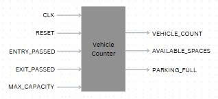
    
| Port | Bus size | Direction | Connection |
|:----:|:--------:|:---------:|:--------|
| clk | 1 | input | From system |
| reset | 1 | input | From system |
| entry_passed | 1 | input | From Sensor Interface Module |
| exit_passed | 1 | input | From Sensor Interface Module |
| max_capacity | 6 | input | From system configuration |
| vehicle_count | 6 | output | → FSM Control Module<br>→ Display Module |
| available_spaces | 8 | output | → Display Module<br>→ System output (available_spaces) |
| parking_full | 1 | output | → FSM Control Module<br>→ Display Module<br>→ System output (parking_full) |

<div align="center">
  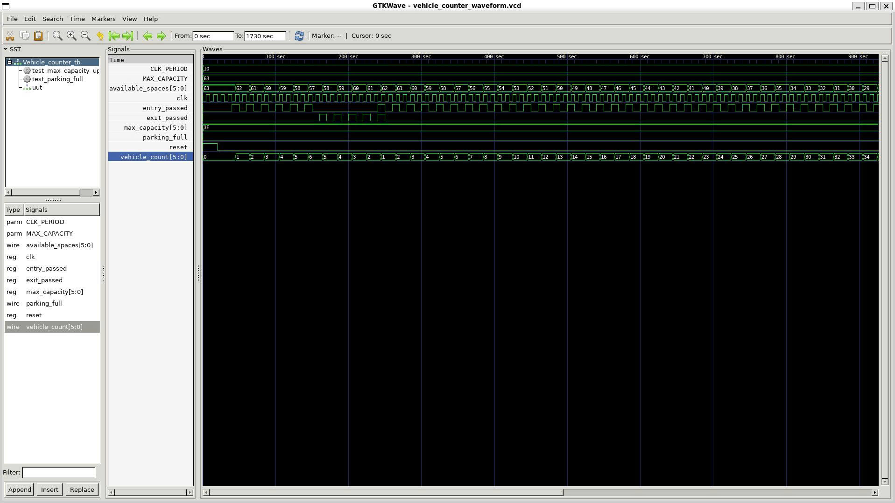
</div>
  </div>
  
  <div style="width: 45%; margin-bottom: 20px;">
    <h4>2. Barrier Control Module</h4>
    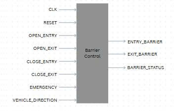
    
| Port | Bus size | Direction | Connection |
|:----:|:--------:|:---------:|:--------|
| clk | 1 | input | From system |
| reset | 1 | input | From system |
| open_entry | 1 | input | From FSM Control Module |
| open_exit | 1 | input | From FSM Control Module |
| close_entry | 1 | input | From FSM Control Module |
| close_exit | 1 | input | From FSM Control Module |
| emergency | 1 | input | From system |
| vehicle_direction | 1 | input | From sensors (0: entry, 1: exit) |
| entry_barrier | 1 | output | → Entry barrier mechanism<br>→ System output |
| exit_barrier | 1 | output | → Exit barrier mechanism<br>→ System output |
| barrier_status | 2 | output | → FSM Control Module<br>→ Display Module |

<div align="center">
  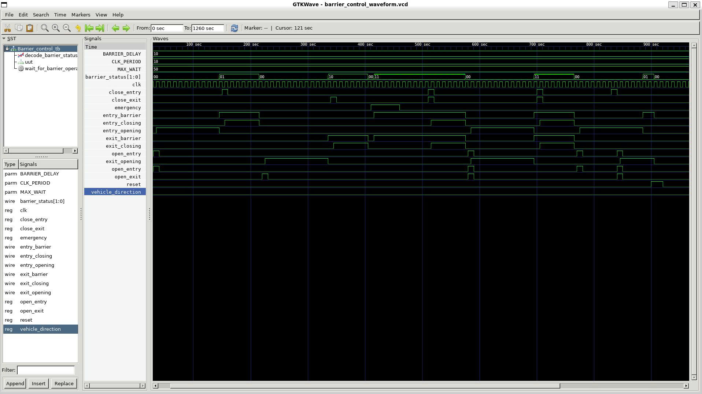
</div>
  </div>
  
  <div style="width: 45%; margin-bottom: 20px;">
    <h4>3. Sensor Interface Module</h4>
    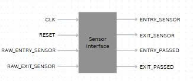
    
| Port | Bus size | Direction | Connection |
|:----:|:--------:|:---------:|:--------|
| clk | 1 | input | From system |
| reset | 1 | input | From system |
| raw_entry_sensor | 1 | input | From entry sensor |
| raw_exit_sensor | 1 | input | From exit sensor |
| entry_sensor | 1 | output | → FSM Control Module |
| exit_sensor | 1 | output | → FSM Control Module |
| entry_passed | 1 | output | → FSM Control Module<br>→ Vehicle Counter Module |
| exit_passed | 1 | output | → FSM Control Module<br>→ Vehicle Counter Module |

<div align="center">
  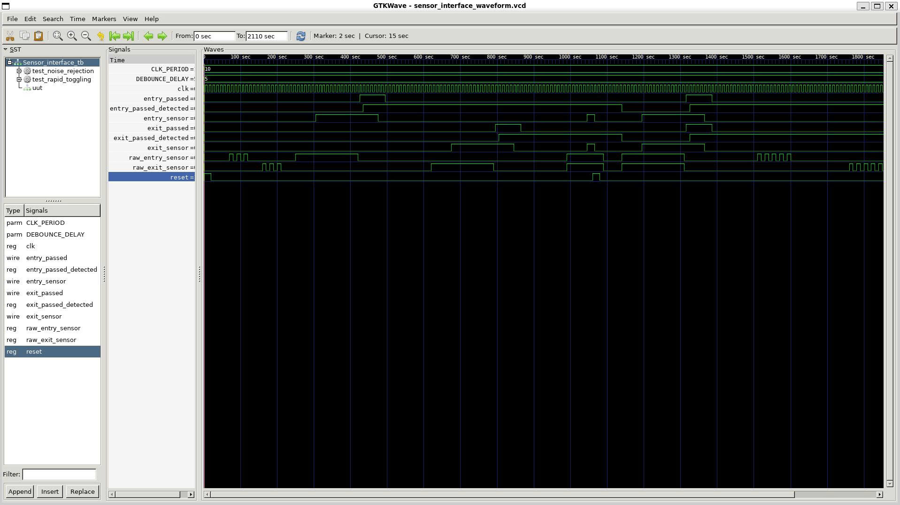
</div>
  </div>
  
  <div style="width: 45%; margin-bottom: 20px;">
    <h4>4. Display Module</h4>
    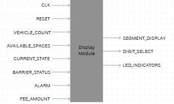
    
| Port | Bus size | Direction | Connection |
|:----:|:--------:|:---------:|:--------|
| clk | 1 | input | From system |
| reset | 1 | input | From system |
| vehicle_count | 6 | input | From Vehicle Counter Module |
| available_spaces | 8 | input | From Vehicle Counter Module |
| current_state | 3 | input | From FSM Control Module |
| barrier_status | 2 | input | From Barrier Control Module |
| alarm | 1 | input | From FSM Control Module |
| fee_amount | 8 | input | From Fee Calculator Module |
| segment_display | 8 | output | → System output |
| digit_select | 4 | output | → System output |
| led_indicators | 4 | output | → System output |

<div align="center">
  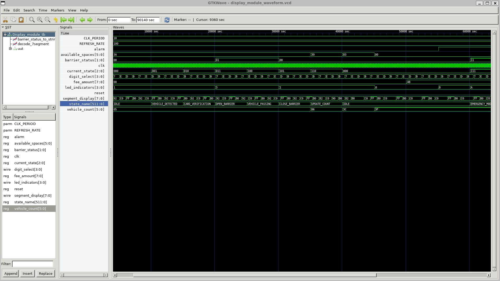
</div>
  </div>
  
  <div style="width: 45%; margin-bottom: 20px;">
    <h4>5. Fee Calculator Module</h4>
    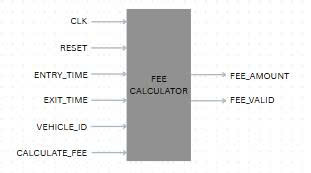
    
| Port | Bus size | Direction | Connection |
|:----:|:--------:|:---------:|:--------|
| clk | 1 | input | From system |
| reset | 1 | input | From system |
| entry_time | 32 | input | From time system |
| exit_time | 32 | input | From time system |
| vehicle_id | 8 | input | From authentication system |
| calculate_fee | 1 | input | From FSM Control Module |
| fee_amount | 8 | output | → Display Module<br>→ System output (fee_amount) |
| fee_valid | 1 | output | → FSM Control Module |

<div align="center">
  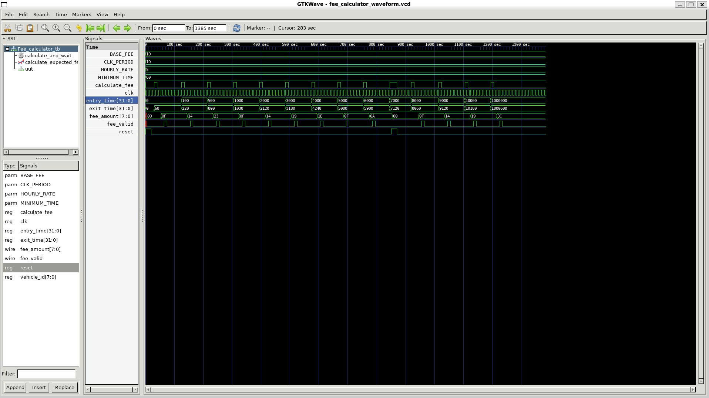
</div>
  </div>
  
  <div style="width: 45%; margin-bottom: 20px;">
    <h4>6. FSM Control Module</h4>
    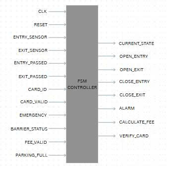
    
| Port | Bus size | Direction | Connection |
|:----:|:--------:|:---------:|:--------|
| clk | 1 | input | From system |
| reset | 1 | input | From system |
| entry_sensor | 1 | input | From Sensor Interface Module |
| exit_sensor | 1 | input | From Sensor Interface Module |
| entry_passed | 1 | input | From Sensor Interface Module |
| exit_passed | 1 | input | From Sensor Interface Module |
| parking_full | 1 | input | From Vehicle Counter Module |
| card_id | 4 | input | From user |
| card_valid | 1 | input | From authentication system |
| emergency | 1 | input | From system |
| barrier_status | 2 | input | From Barrier Control Module |
| fee_valid | 1 | input | From Fee Calculator Module |
| current_state | 3 | output | → Display Module<br>→ System output (state_out) |
| open_entry | 1 | output | → Barrier Control Module |
| open_exit | 1 | output | → Barrier Control Module |
| close_entry | 1 | output | → Barrier Control Module |
| close_exit | 1 | output | → Barrier Control Module |
| alarm | 1 | output | → Display Module<br>→ System output |
| calculate_fee | 1 | output | → Fee Calculator Module |
| verify_card | 1 | output | → Authentication system |

<div align="center">
  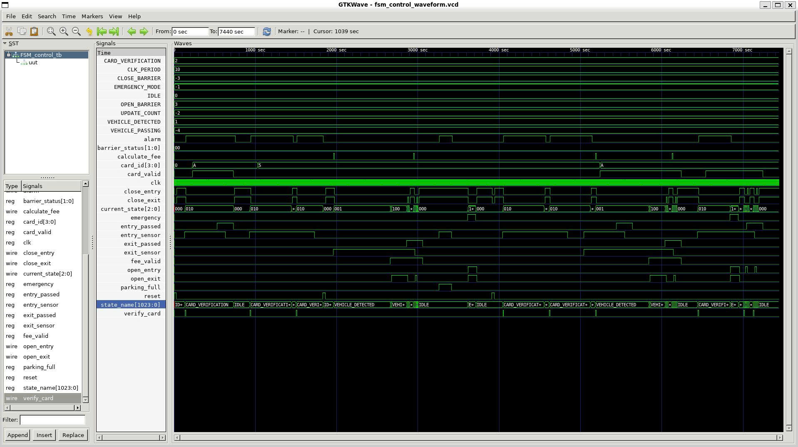
</div>
  </div>
</div>

### Module Interactions

1. **Sensor Interface Module** → **FSM Control Module**:
   - Transmits signals: entry_sensor, exit_sensor, entry_passed, exit_passed
   - FSM Control Module uses these signals to determine the next state

2. **Sensor Interface Module** → **Vehicle Counter Module**:
   - Transmits signals: entry_passed, exit_passed
   - Vehicle Counter Module uses these to update vehicle count

3. **Vehicle Counter Module** → **FSM Control Module**:
   - Transmits signals: vehicle_count, parking_full
   - FSM Control Module uses these to decide whether to allow entry

4. **Vehicle Counter Module** → **Display Module**:
   - Transmits signals: vehicle_count, available_spaces
   - Display Module shows this information to users

5. **FSM Control Module** → **Barrier Control Module**:
   - Transmits commands: open_entry, open_exit, close_entry, close_exit
   - Barrier Control Module executes barrier control commands

6. **Barrier Control Module** → **FSM Control Module**:
   - Transmits status: barrier_status
   - FSM Control Module knows the current state of barriers

7. **FSM Control Module** → **Display Module**:
   - Transmits signals: current_state, alarm
   - Display Module shows status and warnings

8. **FSM Control Module** → **Fee Calculator Module**:
   - Transmits command: calculate_fee
   - Fee Calculator Module begins fee calculation

9. **Fee Calculator Module** → **Display Module**:
   - Transmits result: fee_amount
   - Display Module shows fee amount

10. **Fee Calculator Module** → **FSM Control Module**:
    - Transmits signal: fee_valid
    - FSM Control Module knows fee calculation is complete

## System Integration and Complete Waveform

<div align="center">
  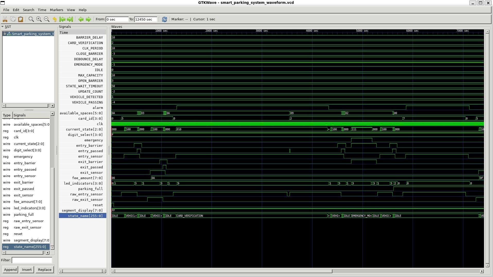
</div>

## Specifications

<div align="center">
  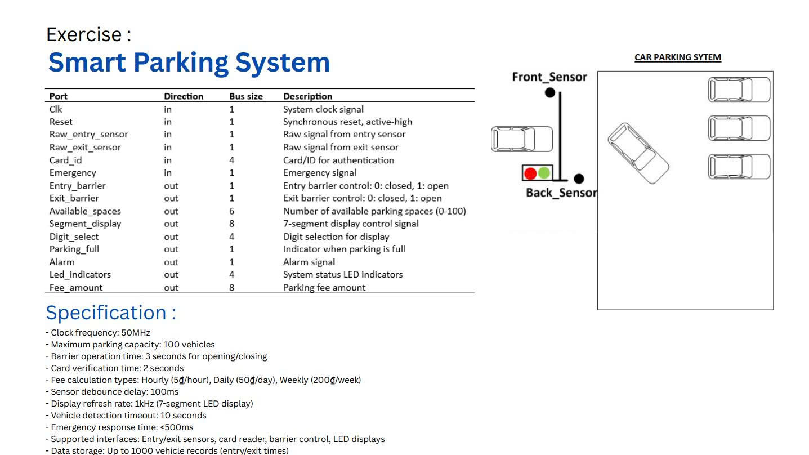
</div>

- **Clock frequency**: 50MHz
- **Maximum parking capacity**: 100 vehicles
- **Barrier operation time**: 3 seconds for opening/closing
- **Card verification time**: 2 seconds
- **Fee calculation types**: Hourly (5₫/hour), Daily (50₫/day), Weekly (200₫/week)
- **Sensor debounce delay**: 100ms
- **Display refresh rate**: 1kHz (7-segment LED display)
- **Vehicle detection timeout**: 10 seconds
- **Emergency response time**: <500ms
- **Supported interfaces**: Entry/exit sensors, card reader, barrier control, LED displays
- **Data storage**: Up to 1000 vehicle records (entry/exit times)

### Hardware Requirements
1. **Hardware Platform**: FPGA board (Xilinx/Altera recommended)
2. **Development Tools**: 
   - Verilog HDL compatible IDE (Vivado/Quartus/ModelSim)
   - Simulation tools for testing

### Functional Requirements

#### 1. Vehicle Detection
- Detect vehicles at entry and exit points using sensors
- Process raw sensor signals to generate clean detection signals
- Confirm vehicle passage through entry/exit points

#### 2. Barrier Control
- Automated opening/closing of entry and exit barriers
- Safety measures to prevent barrier closing while vehicle is passing
- Emergency override capability for all barriers

#### 3. Space Management
- Track total number of vehicles in the parking area
- Calculate and display available parking spaces
- Prevent entry when parking is full

#### 4. Authentication
- Card/ID verification before entry/exit
- Support for different access levels (optional)

#### 5. Fee Calculation
- Record entry time for each vehicle
- Calculate parking fee based on duration
- Display fee amount at exit

#### 6. User Interface
- 7-segment display showing available spaces
- Status indicators for system state
- Fee display at exit points
- Visual/audible alarms for error conditions

### Technical Specifications

#### Input/Output Ports
| Port | Bus size | Direction | Description |
|:----:|:--------:|:---------:|:------------|
| clk | 1 | input | System clock signal |
| reset | 1 | input | Synchronous reset, active-high |
| raw_entry_sensor | 1 | input | Raw signal from entry sensor |
| raw_exit_sensor | 1 | input | Raw signal from exit sensor |
| card_id | 4 | input | Card/ID for authentication |
| emergency | 1 | input | Emergency signal |
| entry_barrier | 1 | output | Entry barrier control: 0: closed, 1: open |
| exit_barrier | 1 | output | Exit barrier control: 0: closed, 1: open |
| available_spaces | 8 | output | Number of available parking spaces (0-100) |
| segment_display | 8 | output | 7-segment display control signal |
| digit_select | 4 | output | Digit selection for display |
| parking_full | 1 | output | Indicator when parking is full |
| alarm | 1 | output | Alarm signal |
| led_indicators | 4 | output | System status LED indicators |
| fee_amount | 8 | output | Parking fee amount |

### State Machine
The system operates using a finite state machine with the following states:
- IDLE
- VEHICLE_DETECTED
- CARD_VERIFICATION
- OPEN_BARRIER
- VEHICLE_PASSING
- CLOSE_BARRIER
- UPDATE_COUNT
- ALARM
- EMERGENCY_MODE
- RESET

#### State Machine Diagram
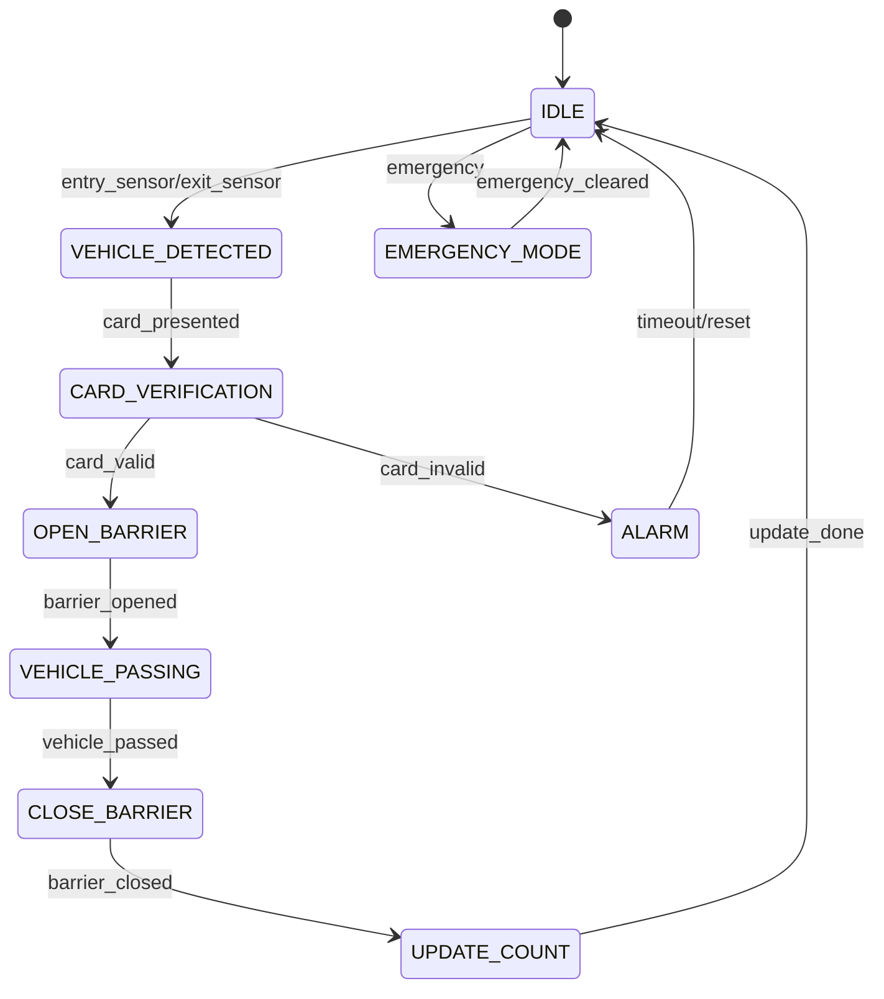

### System Operation Flow

#### Entry Process
1. **Sensor Interface Module** detects vehicle arrival (raw_entry_sensor → entry_sensor)
2. **FSM Control Module** receives signal and checks with **Vehicle Counter Module** if parking is available
3. **FSM Control Module** requests card verification and checks validity
4. **FSM Control Module** sends open barrier command (open_entry) to **Barrier Control Module**
5. **Barrier Control Module** opens entry barrier (entry_barrier = 1)
6. **Sensor Interface Module** detects vehicle passage (entry_passed = 1)
7. **FSM Control Module** sends close barrier command (close_entry) to **Barrier Control Module**
8. **Vehicle Counter Module** increments vehicle count and updates available spaces
9. **Display Module** updates the available spaces display

#### Exit Process
1. **Sensor Interface Module** detects vehicle at exit (raw_exit_sensor → exit_sensor)
2. **FSM Control Module** receives signal and requests card verification
3. **FSM Control Module** sends calculate fee command (calculate_fee) to **Fee Calculator Module**
4. **Fee Calculator Module** calculates fee and sends result (fee_amount) to **Display Module**
5. **FSM Control Module** sends open barrier command (open_exit) to **Barrier Control Module**
6. **Barrier Control Module** opens exit barrier (exit_barrier = 1)
7. **Sensor Interface Module** detects vehicle passage (exit_passed = 1)
8. **FSM Control Module** sends close barrier command (close_exit) to **Barrier Control Module**
9. **Vehicle Counter Module** decrements vehicle count and updates available spaces
10. **Display Module** updates the available spaces display

## Directory Structure
```
Smart_parking_verilog/
├── Barrier_control/      # Barrier control module files
├── Display_module/       # Display module files
├── Fee_calculator/       # Fee calculator module files
├── FSM_control/          # FSM control module files
├── Sensor_interface/     # Sensor interface module files
├── Vehicle_counter/      # Vehicle counter module files
├── Smart_parking_system/ # Top-level system integration files
├── image/                # Documentation images
├── backup/               # Backup files
├── README.md             # Project documentation
```

## Testing Strategy
1. **Module Testing**: Individual test benches for each module
2. **Integration Testing**: Combined module testing
3. **System Testing**: Full system simulation with various scenarios:
   - Normal entry/exit flow
   - Full parking lot handling
   - Emergency situations
   - Error conditions

## Implementation Requirements
For physical implementation, the following components are needed:
1. FPGA or development board
2. Infrared or ultrasonic sensors for vehicle detection
3. Servo motors for barrier control
4. LED displays
5. Power supply

## Extension Possibilities
1. **Time Display**: Add parking duration display
2. **Advanced Fee Calculation**: Variable rates based on time of day
3. **Specific Parking Spot Management**: Track and display specific available spots
4. **License Plate Recognition**: Simulated license plate recognition
5. **Payment System Integration**: Interface with payment systems

## Implementation Guidelines
1. Use synchronous design principles
2. Implement debouncing for all sensor inputs
3. Use parameterized modules for flexibility
4. Include comprehensive test benches for each module
5. Document all module interfaces and state transitions 

## Contact & Repository

- **GitHub**: [https://github.com/KNguyen260404](https://github.com/KNguyen260404)
- **Email**: nguyenvhk.22ceb@vku.udn.vn
- **Project Repository**: [https://github.com/KNguyen260404/Smart_parking_system_verilog](https://github.com/KNguyen260404/Smart_parking_system_verilog)

## License

This project is licensed under the Nguyen :) License - see the LICENSE file for details. 
